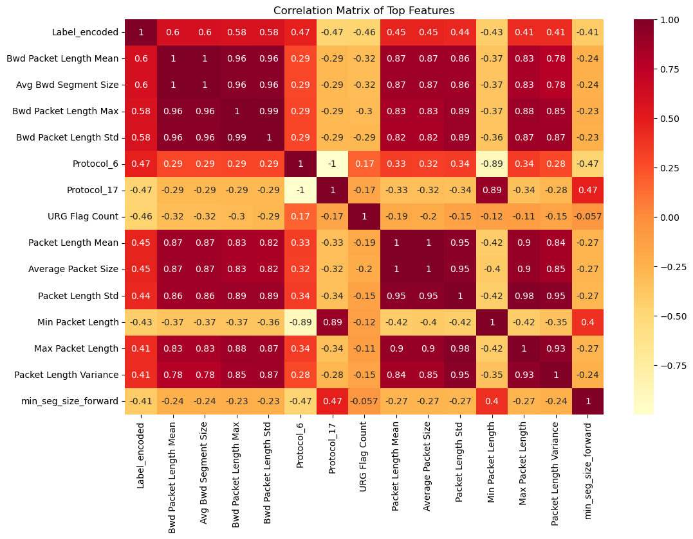

# Project Submission
## DDoS Detection based on Network Flow Statistics
Hunter Treadway\
Muhammad Qassim\
Toby Okoye\
May 3, 2024

## Personal Contribution

```Hunter Treadway```

1) Domain expertise
    * With my domain expertise in Computer Networking, I was able to provide initial insights into the dataset to help guide data preprocessing and initial EDA.
2) Discovery of Dataset Problems
    * After the initial groundwork, I performed an extensive analysis of the dataset and successfully discovered issues about feature importances.
    * Imbalances in the dataset would give away the label
    * Easy-to-detect features would also give away the label
3) Feature Engineering
    * I provided an extensive, manual review of features to determine which features would be most useful for our goals.
    * Performed initial dimensionality reduction, eliminating features until a drastic change in accuracy occured.
    * Constantly reintroduced and removed features until a "sweetspot" was found.
4) Tuned improvement models until a final model was chosen.
    * Random Forest and Gradient Boosting Classifiers
    * Grid Searches to tune parameters.

## Project Summary
The goal of this project is to carefully examine the features of DDoS to train a model to detect DDoS network traffic. Many features of a **_standard_** DDoS attack are easily detectable, however a skilled attacker can tune a DDoS attack to drastically drop detection rates. We seek to find features within the dataset that can give away a DDoS attack that:
1) ```Are Protocol Agnostic``` - Don't have features only belonging to TCP/UDP/ICMP traffic.
2) ```Belong to any DDoS attack```, no matter how tuned the attack.
Training a model on these features will generalize better to the data, and increase the detection rate of well-crafted DDoS attacks.

## Problem Statement
DDoS attacks are amongst the most prevelant and dangerous threats across the internet. By creating effective Machine Learning models capable of rapidly detecting DDoS traffic, the decision process for denying DDoS traffic can be automated at a faster pace that many current technologies and professionals are capable of doing.

Amongst many of the different types of network attacks, Distributed Denial of Service (DDoS) Attacks remain one of the most difficult to detect and mitigate. Recently, DDoS attacks have become more sophisticated where packets are carefully crafted to appear as legitimate traffic flows, with one research paper by Yu Mi et al. positing that DDoS attack detection rates can be under 50% if crafted well enough ([AutoDefense: RL Based Autoreactive Defense Against Network Attacks](https://ieeexplore.ieee.org/document/9947232)). By closely observing the subtle differences in DDoS traffic to legitimate traffic, we believe a Machine Learning model can be trained to detect these well-crafted attacks with greater accuracy.

By analyzing this dataset, we look to detect DDoS Attacks based on the careful consideration of each feature of network flows. Easy to detect features of standard attacks will likely be minimized by skilled attackes, therefore we seek to uncover features of an attack that cannot be hidden due to the nature of the attack.


## Dataset
The CIC-DDoS2019 dataset comes from the University of New Brunswick. The data was generated in a secure testbed (performing DDoS attacks across the internet is frowned upon, therefore a simulation of attacks is easier to produce) using "the most up-to-date common DDoS attacks". Packet information was captured into .pcap files, where packets were organized into network flows and analyzed for various statistics such as average packet inter-arrival time, average packet size, flow duration, the number of packets in the flow, etc. Initially, we plan to measure informal success based on the accuracy of our models versus the low detection rate of DDoS traffic flows.

The dataset contains 225000+ rows and 85 columns of data that shows features of network flows between two endpoints. Each row is labeled as either BENIGN or DDoS, where DDoS is the label for malicious traffic flows.

#### Processing Tools
Initial cleaning of the dataset included:
1) Dropping obviously useless features, such as the "flow-id" column.
2) Dropping rows containing null values.
3) Encoding the label column from Benign and DDoS to 0 and 1 respectively.
4) Normalizing the data with a MinMaxScaler, as many values were either extremely large or very small. (I.e. discrete features would have sizes of millions of packet arrivals, where continuous feature like mean arrival time could be in microseconds).

Some features were one-hot encoded, but were ultimately dropped later on, such as the Protocol Column.


### Motivation
The dataset was created by the University of New Brunswick to analyze the complex features of network traffic flows in order to differentiate DDoS traffic flows from benign flows. As DDoS attacks become more prevelant and complex, systems will need to be able to detect, mitigate, or withstand such assaults.

### Composition
With 85 columns, the dataset is rich with information about network traffic flows. Many of the features are self explanatory, especially the first few such as "Source IP" and "Source Port" that are the Source IP Address and Source Port Number respectively. Other features are grouped together by type, such as IAT (inter-arrival time) where statistics on the inter-arrival time's are shown: IAT Mean, IAT Std (Standard Deviation). Any feature labeled "Fwd" is forward traffic (traffic from the source device to the destination device) and traffic labeled "Bwd" goes from the destination device to the source device. 

```List of all Features```\
Flow ID, Source IP, Source Port, Destination IP, Destination Port, Protocol, Timestamp, Flow Duration, Total Fwd Packets, Total Backward Packets,Total Length of Fwd Packets, Total Length of Bwd Packets, Fwd Packet Length Max, Fwd Packet Length Min, Fwd Packet Length Mean, Fwd Packet Length Std,Bwd Packet Length Max, Bwd Packet Length Min, Bwd Packet Length Mean, Bwd Packet Length Std,Flow Bytes/s, Flow Packets/s, Flow IAT Mean, Flow IAT Std, Flow IAT Max, Flow IAT Min,Fwd IAT Total, Fwd IAT Mean, Fwd IAT Std, Fwd IAT Max, Fwd IAT Min,Bwd IAT Total, Bwd IAT Mean, Bwd IAT Std, Bwd IAT Max, Bwd IAT Min,Fwd PSH Flags, Bwd PSH Flags, Fwd URG Flags, Bwd URG Flags, Fwd Header Length, Bwd Header Length,Fwd Packets/s, Bwd Packets/s, Min Packet Length, Max Packet Length, Packet Length Mean, Packet Length Std, Packet Length Variance,FIN Flag Count, SYN Flag Count, RST Flag Count, PSH Flag Count, ACK Flag Count, URG Flag Count, CWE Flag Count, ECE Flag Count, Down/Up Ratio, Average Packet Size, Avg Fwd Segment Size, Avg Bwd Segment Size, Fwd Header Length,Fwd Avg Bytes/Bulk, Fwd Avg Packets/Bulk, Fwd Avg Bulk Rate, Bwd Avg Bytes/Bulk, Bwd Avg Packets/Bulk,Bwd Avg Bulk Rate,Subflow Fwd Packets, Subflow Fwd Bytes, Subflow Bwd Packets, Subflow Bwd Bytes,Init_Win_bytes_forward, Init_Win_bytes_backward, act_data_pkt_fwd, min_seg_size_forward, Active Mean, Active Std, Active Max, Active Min,Idle Mean, Idle Std, Idle Max, Idle Min, Label.

### Collection Process
Data was generated in a test environment using information on current DDoS techniques.

## Exploratory Data Analysis
Initially, we had used heatmaps and pairplots to help us determine what features to look for.




We figured a manual review of 85 features would take too long, and sought to avoid this process if we could. Ultimately, this turned out to be a bad decision, and was actually the opposite of what we had intended to discover obscure features. We were only looking at the most highly correlated, most **_easy-to-detect_** features, when we needed the features hidden by these **_easy-to-detect_** features.

What helped us the most was looking at feature importances.


In realizing that some feature importances were essentially "labels", we started a <u>**_manual review_**</u> of the features and discovered that many features in the dataset would give away the label.

Normalizing the data, we ultimately went with a MinMaxScaler, as many values were either extremely large or very small. (I.e. discrete features would have sizes of millions of packet arrivals, where continuous feature like mean arrival time could be in microseconds).

## Data Preprocessing
As part of data preprocessing, we were able to determine from our preliminary models that out of many features determine the label of the data. By dropping and then reintroducing many features over many different iterations, we were able to discover features that could provide good accuracy, precision, and recall without giving away the label. Out of 85 original features, we were able to reduce down to only 15 features that were not listed in top correlating features that were still able to provide good results. 

## Machine Learning Approaches
### Baseline
Our baseline evaluation setup sought to run some simple ML models early on (such as KNN and Logistic Regression), even before we cleaned up our features very much. 

```Logistic Regression```


Surprisingly, the accuracy of our models were already well above 90% for data we had hardly cleaned up. This led us to make important EDA decisions which helped us make some discoveries about some of the features in our model: some features would give away the label, and the model would almost ignore all other features. For example, even after dropping some of the more used features:

```Feature Importances of a Decision Tree Classifier```


During most of our modeling, we chose to use Decision Tree Classifiers, and later Random Forest Classifiers as our improvement models. Our dataset consists of a lot of non-linear data, and trees are excellent at modeling such data. Also, the bonus of using an ensembling technique of using Random Forest provided better results than a single Decision Tree Classifier. Towards the end of our modeling, we started using a Gradient Boosting Classifier to see if we could tune it, have errors between estimators corrected, and see if we could ultimately achieve better results than the Random Forest Classifier. Although close, the tuned Random Forest Classifier still performed marginally better.


## Experiments
A compilation of our Experiments are listed in [project.ipynb](project.ipynb). Our work got divided between 4 different files so that we could work independently from each other, as well as not have to rerun large amounts of data. [Project.ipynb](project.ipynb) compiles the most important aspects of our work into one file. To discover a good set of features to use, many models were created to manually test different features. In the end, we had run 20 Decision Trees, 22 Random Forest, 9 Gradient Boosting Machines, and had tested about 5 Grid Searches for Random Forests and Gradient Boosting Machines that took hours to run.

### Evaluation Metrics
Our baseline models started by evaluating accuracy.
* Our accuracy was too high too early

Once we got close to discovering our chosen features, we started focusing more on Recall, then Precision.
* Our FN values represent DDoS attacks that are not detected, and so it was most important to greatly increase Recall
* FP values represent legitimate traffic labelled as malicious. Although not inherently dangerous, this causes a lot of resources to be spent on non-issues.

### Baseline Model vs Final Model
Our KNN and Logistic Regression baseline models would score accuracies in the high 90s. Regardless of the "good" score, it became obvious that a real DDoS attack from a skilled attacker would avoid the features that signal a DDoS attack. So in actuality, the baseline model was likely not good at all. Could it detect more subtle attacks, or is it too reliant on the expected, more prominent features?

Our final model, a reasonably-well tuned Random Forest Classifier, performed exceptionally well on a small subset of the dataset where each feature by themselves would not overtly give away the label.


### Error Analysis and Future Improvement
The precision of our model is not where we would like it, although this is not as dangerous as bad recall.
Although our recall scored well with the dataset, a future improvement would be to get the recall even higher. An actual attack could consist of 10s of millions of devices, each with their own network flow to the target. A Recall of 99% means 1 out of every 100 attacks would be labelled as Benign. In the case of 10,000,000 attack flows, this would mean 100,000 attack flows get incorrectly labelled, and this many concurrent flows could wreak havoc on the target. A Recall score for something this important should probably be greater than 99.999%. To achieve this without risk of overfitting, we would likely need more data points than what we had modeled.

## Conclusion
### What did not work
Starting the project by looking at the top correlating features was a terrible idea. Although it eventually helped us to discover how we should actually approach the project, a different approach might have gotten us there more quickly. 

### What do you think why?
We had stated that we wanted to search for subtle features to distinguish DDoS traffic from Benign traffic. The top correlating features were the opposite of what we wanted, as these were the least subtle, most prominent giveaways of a DDoS attack.

### What were approaches, tuning model parameters you have tried?
After taking the approach to manually determine our desired features, we tried tuning our Random Forests and Gradient Boosting Classifiers by adjusting n_estimators, max_depth, class_weight, learning_rate, and subsamples (to make the Gradient Boosting Classifier more Stochastic). We were able to get slightly better results as we tuned the classifiers.

### What features worked well and what didn't
Almost all of our features did not work well, by actually working too well.
Our 15 "sweetspot" features provided good results, even 99% Recall, without immediately giving away the label:

```Sweetspot```
* Flow IAT Std     
* Flow Duration    
* Flow IAT Mean     
* Flow IAT Max      
* Flow Bytes/s      
* Active Mean       
* Active Max        
* Active Min       
* Flow IAT Min      
* Idle Min          
* Flow Packets/s    
* Idle Mean         
* Idle Max         
* Active Std        
* Idle Std

### How was that a data-driven decision?
Our feature selection was data-driven in the case of, by analyzing the results and feature importances, we were able to discover features that provided strong results without giving away the label.
